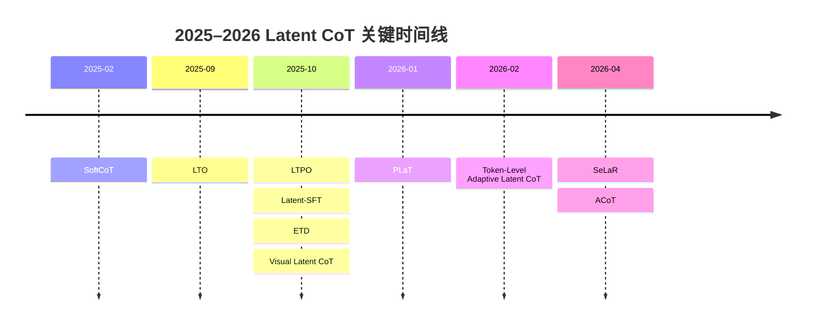

# 潜在思维链研究进展报告

## 执行摘要

从 2025 到 2026，Latent CoT 的主线已经明显分化成四类：一类把 latent token 约束到词表或软嵌入空间，代表是 Latent-SFT 与 SeLaR；一类把 latent reasoning 视为测试时可优化对象，代表是 LTPO 与 LTO；一类把 latent computation 内化到预训练或中训的递归深度中，代表是 Token-Level Adaptive Latent CoT 与 ETD；还有一类把 latent reasoning 重新离散化为“抽象语言”，最典型就是 ACoT。这个分化说明，研究焦点已经不再只是“能不能做 latent reasoning”，而是“latent carrier 用什么、何时启用、怎样训练、怎样在难题上保持稳健”。citeturn36search1turn16view0turn20view4turn25view0turn8view1turn8view2turn8view0

就与 ACoT 的直接相关性而言，我认为最重要的结论有三点。第一，**Latent-SFT 是最接近 ACoT 的 2025 前驱**：两者都试图解决“latent token 不可学、不可控”的结构化问题，只是 Latent-SFT 选择词表列空间上的软嵌入，而 ACoT 选择保留词表之外的离散抽象 codebook。第二，**SeLaR 和 LTPO 代表了部署侧最强的补充路线**：它们不必像 ACoT 那样进行专门后训练，而是在测试时选择性启用或直接优化 latent thoughts。第三，**ACoT 自己是目前最像“可落地 latent CoT 替代 verbal CoT”的方案**：它在多个模型家族上，以远少于 verbal CoT 的 reasoning tokens，逼近甚至局部超过 verbal CoT 的后训练结果。citeturn18view1turn21view0turn27view1turn10view0turn33view4turn33view5

ACoT 的标志性结果是：在 [Thinking Without Words: Efficient Latent Reasoning with Abstract Chain-of-Thought](https://arxiv.org/abs/2604.22709) 中，Qwen3-8B 的 Abstract-CoT（Warm-up + RL）在 MATH-500 上达到 90.8，而 verbal SFT+RL 为 92.6，但 token 数从 1671 压到 144；在 HotpotQA 上则达到 58.8 F1，略高于 verbal SFT+RL 的 58.1，同时 token 数仅 171；在更难的 GPQA-Diamond 与 AIME’25 上，它也基本贴近 verbal SFT+RL，只是仍略低一点。更关键的是，论文报告在 MATH-500 上的 token 压缩比达到 10.4–11.6×，在 HotpotQA 上达到 4.0–4.3×。这说明 ACoT 不是单纯“缩短回答”，而是真实地把相当一部分 reasoning 迁移到了离散抽象 token 序列里。citeturn10view0turn9view0turn33view4turn33view5

如果只保留一个总体判断，那么就是：**到 2026 年春，Latent CoT 最有前景的方向不再是“纯隐藏态递归”本身，而是“结构化 latent carrier + 选择性/自适应 compute + 可验证的训练目标”三者结合**；A CoT、Latent-SFT、SeLaR 三篇最能体现这一趋势。citeturn16view0turn20view4turn8view0

## 背景与检索方法

Latent CoT 的背景很明确：传统 verbal CoT 在复杂推理中有效，但它把中间推理完全暴露为文本，带来高 token 成本、长延迟、以及训练时对显式推理轨迹的强依赖。2025 年的一篇综述把这一方向系统化为 token-wise strategies、internal mechanisms、analysis 与 applications 四类，也反映出该领域已从单点技巧进入谱系化发展阶段。citeturn36search1

本报告的检索窗口限定为 **2025-01-01 到 2026-04-29**。检索优先级按 **entity["organization","arXiv","preprint repository"] 全文 / PDF > 官方会议页与 entity["organization","OpenReview","peer review platform"] > 作者主页 > entity["company","GitHub","code hosting platform"] > entity["organization","Google Scholar","scholarly index"]** 执行；其中 Scholar 只做召回与交叉核对，不作为事实主证据。重点覆盖的正式 venue 包括 entity["organization","NeurIPS","machine learning conference"]、entity["organization","ICLR","representation learning conf"]、entity["organization","ACL","computational linguistics conf"]、entity["organization","AAAI","AI society conf"]。检索关键词以 “latent chain-of-thought / latent reasoning / abstract chain-of-thought / latent thought policy optimization / recursive latent thoughts / adaptive latent CoT / vocabulary-space superposition” 为主，并结合 2025 综述做前后向追踪。citeturn36search1turn7view3turn39search1

为了保持可比性，我把**核心集**限制为八篇：它们要么直接提出新的 latent carrier / latent compute / latent training / latent test-time optimization 机制，要么在 ACoT 的对照框架里足够重要。**不进入主表但值得补读**的工作包括：早期连续空间基线 [SoftCoT](https://arxiv.org/abs/2502.12134)（ACL 2025）、理论文 [A Formal Comparison Between Chain-of-Thought and Latent Thought](https://arxiv.org/abs/2509.25239)、理论文 [The Theoretical Benefits and Limitations of Latent Chain-of-Thought Reasoning](https://openreview.net/forum?id=q7Nhu2Fw11)，以及多模态延展 [Latent Chain-of-Thought for Visual Reasoning](https://arxiv.org/abs/2510.23925)。这些论文很重要，但要么偏理论、要么偏多模态、要么与 ACoT 的实验口径不够同类，因此不纳入逐篇深挖。citeturn39search0turn39search1turn35search1turn35search0turn34search0turn34search1

## 核心论文排序

下表按“与 ACoT 的机制相似性、实验可比性、对 2025–2026 latent CoT 讨论的代表性”综合排序。相关度为 1–5 的主观评分。

| 排名 | 论文 | 作者 | 年份 | Venue | 链接 | 一句话贡献 | 相关度 |
|---|---|---|---:|---|---|---|---:|
| 1 | [Thinking Without Words: Efficient Latent Reasoning with Abstract Chain-of-Thought](https://arxiv.org/abs/2604.22709) | Keshav Ramji et al. | 2026 | arXiv；相关 workshop 版见 ICLR 2026 LIT | [arXiv](https://arxiv.org/abs/2604.22709) · [OpenReview](https://openreview.net/forum?id=frSSQ7fWFX) citeturn8view0turn7view1 | 用保留 codebook 训练离散抽象 reasoning 语言，在大幅压缩 token 的同时逼近 verbal CoT。 | 5 |
| 2 | [Latent Reasoning in LLMs as a Vocabulary-Space Superposition](https://arxiv.org/abs/2510.15522) | Jingcheng Deng et al. | 2025 | arXiv；Submitted to ICLR 2026 | [arXiv](https://arxiv.org/abs/2510.15522) · [OpenReview](https://openreview.net/forum?id=ciiKoeM206) · [GitHub](https://github.com/DJC-GO-SOLO/Latent-SFT) citeturn16view0turn7view0 | 把 latent token 定义为词表嵌入的软组合，用两阶段 KL+CE 训练让 latent reasoning 可学、可压缩。 | 5 |
| 3 | [SeLaR: Selective Latent Reasoning in Large Language Models](https://arxiv.org/abs/2604.08299) | 作者见原文 | 2026 | arXiv | [arXiv](https://arxiv.org/abs/2604.08299) citeturn20view4turn21view0 | 用 entropy gating 只在高不确定步骤启用 soft latent reasoning，并用 contrastive regularization 防止 collapse。 | 4 |
| 4 | [Thinking on the Fly: Test-Time Reasoning Enhancement via Latent Thought Policy Optimization](https://arxiv.org/abs/2510.04182) | Wengao Ye et al. | 2025/2026 | ICLR 2026 Poster | [arXiv](https://arxiv.org/abs/2510.04182) · [OpenReview](https://openreview.net/forum?id=r1WEQzkCQv) · [GitHub](https://github.com/ltpo2025/LTPO) citeturn25view0turn7view3turn29view0 | 不改模型参数，只在测试时用 policy gradient 直接优化 latent thought 向量。 | 4 |
| 5 | [Pretraining with Token-Level Adaptive Latent Chain-of-Thought](https://arxiv.org/abs/2602.08220) | Boyi Zeng et al. | 2026 | arXiv | [arXiv](https://arxiv.org/abs/2602.08220) citeturn8view1turn12view0 | 把 latent CoT 内化到预训练里，并用 token-wise adaptive halting 让难 token 多想、易 token 少想。 | 4 |
| 6 | [Latent Chain-of-Thought as Planning: Decoupling Reasoning from Verbalization](https://arxiv.org/abs/2601.21358) | Jiecong Wang et al. | 2026 | arXiv | [arXiv](https://arxiv.org/abs/2601.21358) · [GitHub](https://github.com/yunsaijc/PLaT) citeturn23view0turn37search10 | 把 latent reasoning 重写为 planner–decoder 分离的连续规划过程，强调 Pass@k 多样性与可检查性。 | 4 |
| 7 | [Encode, Think, Decode: Scaling test-time reasoning with recursive latent thoughts](https://arxiv.org/abs/2510.07358) | Yeskendir Koishekenov et al. | 2025 | arXiv；LIT @ ICLR 2026 | [arXiv](https://arxiv.org/abs/2510.07358) · [OpenReview](https://openreview.net/forum?id=jY5Kh5Rjc7) citeturn8view2turn38search7 | 在 reasoning-relevant 层上递归复用中间块，用更深的 latent compute 换取 test-time reasoning 增益。 | 3 |
| 8 | [Latent Thinking Optimization: Your Latent Reasoning Language Model Secretly Encodes Reward Signals in Its Latent Thoughts](https://arxiv.org/abs/2509.26314) | Hanwen Du et al. | 2025/2026 | arXiv；ICLR 2026 | [arXiv](https://arxiv.org/abs/2509.26314) · [GitHub](https://github.com/ninglab/LTO) citeturn8view3turn38search1turn38search14 | 训练一个轻量 latent reward model，在 latent space 上做选择与纠偏。 | 3 |

## 发布时间线与方法谱系

如果把 2025–2026 当作一个连续演化过程，最清楚的路径是：**2025 年早期先出现连续空间软 thought 的工程化方案（SoftCoT）；2025 年下半年转向更强的结构化 latent carrier、test-time latent optimization 与递归 latent compute；到 2026 年，研究开始在“可学的离散抽象语言”“选择性启用 latent reasoning”“预训练内化 latent CoT”三条线上并进**。这一时间顺序来自论文发布时间与官方 venue 页面。citeturn39search0turn16view0turn8view2turn25view0turn23view0turn8view1turn20view4turn8view0

从方法谱系看，最值得记住的不是“谁更新”，而是“谁在解决什么瓶颈”。**Latent-SFT 与 ACoT**都在解决 latent token 很难学的问题，但前者把 latent token 放回词表几何，后者则发明一套保留 codebook；**SeLaR 与 LTPO**都在解决测试时 latent reasoning 的鲁棒性，但前者是 selective activation，后者是直接优化向量；**Adaptive Latent CoT 与 ETD**都试图把 reasoning 变成“内部额外计算”，但一个发生在 token 级预训练，一个发生在 reasoning-relevant 层的递归中训；**PLaT**则把 latent reasoning 明确拆成 planning 与 verbalization 两个模块，是最接近“planner architecture”的一支。citeturn19view0turn33view0turn20view4turn29view0turn13view4turn23view0

## 逐篇评析

#### [Thinking Without Words: Efficient Latent Reasoning with Abstract Chain-of-Thought](https://arxiv.org/abs/2604.22709)

**问题与方法。** 这篇论文来自 entity["organization","IBM Research","research lab"]，核心问题是：continuous latent reasoning 虽然省 token，但往往显著落后 verbal CoT。作者提出 **Abstract Chain-of-Thought**：给 tokenizer 扩展一套全新的保留 codebook，并让模型在回答前先生成一小段只允许来自该 codebook 的“抽象 reasoning 序列”。训练分两段：先通过 policy-iteration 风格 warm-up 在 verbal CoT 与 abstract codebook 之间建立映射，再做 warm-started RL。它不是从 teacher rationale 中逐步量化压缩，而是让模型学会一种新的、非自然语言的 reasoning language。citeturn8view0turn33view0turn33view1turn33view3

**架构、目标与结果。** ACoT 在 Qwen3-8B、Qwen3-4B、Granite 4.0 Micro 与 Qwen3-32B 上评估，任务覆盖 MATH-500、AlpacaEval、HotpotQA、GPQA-Diamond、AIME’25。Qwen3-8B 上，Warm-up + RL 的 ACoT 在 MATH-500/AlpacaEval/HotpotQA 分别为 90.8 / 60.8 / 58.8，对应 token 仅 144 / 225 / 171；verbal SFT+RL 则是 92.6 / 58.4 / 58.1，对应 token 为 1671 / 496 / 735。更难的 GPQA-Diamond 与 AIME’25 上，ACoT 为 50.5 / 24.4，verbal SFT+RL 为 51.5 / 25.6，但 token 分别只有 174 / 3438，而 verbal 需要 1382 / 9343。优点是性能—token 比极强，且跨模型家族有效；局限是仍需专门后训练与 RL，难题上尚未完全超过 verbal CoT。**与 ACoT 的关系**：这是本报告的基准参考点。代码方面，我在优先源中未核验到官方公开仓库。citeturn10view0turn33view4turn33view5turn9view0turn33view6

#### [Latent Reasoning in LLMs as a Vocabulary-Space Superposition](https://arxiv.org/abs/2510.15522)

**问题与方法。** Latent-SFT 的判断非常关键：传统 hidden-state latent tokens 难学，不只是因为“没有监督”，还因为最后一层 hidden states 与 token embedding 分布明显不对齐。作者因此把 latent token 定义成**词表嵌入的线性组合**，使其始终落在 vocabulary column space / embedding manifold 中；训练采用两阶段框架：先生成 latent token 的 soft labels，再用 **KL（latent slots）+ CE（explicit slots）** 训练模型自主生成 latent reasoning。论文还引入 LTIM 与 LTSuM 两种 mask 来控制信息压缩与监督解码。citeturn16view0turn18view2turn19view0

**架构、目标与结果。** 低难度设置使用 LLaMA-3.2-1B-Instruct，在 GSM8k-Aug、GSM-Hard、SVAMP、MultiArith 上评估；高难度设置使用 DeepSeek-Distill-Qwen-7B，在 MATH-500 与 AIME24 上评估。最显著的数值是：Latent-SFT(2) 在 GSM8k-Aug 达到 50.4，超过 CoT-SFT 的 49.4，同时 reasoning 长度从 25.6 降到 12.4；在 MultiArith 达到 93.8，也略高于 CoT-SFT 的 93.2。高难度上，Soft Embedding 版本在 MATH-500/AIME24 为 79.8/19.2，明显优于 Hidden State 版本的 67.8/7.78，但仍显著落后于 CoT-SFT 的 92.6/54.4。优点是首次系统证明“词表几何对齐”对 latent reasoning 至关重要；局限是长链高难题仍明显掉点。**与 ACoT 的关系**：它是 ACoT 最直接的 2025 前驱；两者都在给 latent token 找“结构化语义载体”，差别在于 Latent-SFT 用 soft lexical superposition，ACoT 用离散 abstract codebook。代码已公开。citeturn18view0turn18view1turn19view0turn17view6

#### [SeLaR: Selective Latent Reasoning in Large Language Models](https://arxiv.org/abs/2604.08299)

**问题与方法。** SeLaR 针对的是 training-free latent reasoning 的两个经典失败点：一是全程 soft reasoning 会扰乱那些本来就很确定的 decoding steps，二是 soft embedding 会很快坍缩到 top-1 token。作者因此提出 **entropy-gated selective activation**：只有在 top-k 熵高于阈值的 exploratory steps 才启用 latent reasoning；并加入 **entropy-aware contrastive regularization**，按不确定度把 soft embedding 从 dominant token 方向上稍微“推开”，从而保留多条竞争路径。citeturn20view4turn21view0

**架构、目标与结果。** 它不需要额外训练，直接在 Qwen3-1.7B/8B/32B 和 DeepSeek-R1-Distill-Llama-8B 上评测五个 benchmark：GSM8K、MATH500、GPQA、AIME2024、AIME2025。Qwen3-8B 上，SeLaR 的平均准确率为 83.56，高于 CoT (Sampling) 的 79.68；其中 AIME2024 从 76.67 提高到 83.33，AIME2025 从 66.67 提高到 80.00。Qwen3-32B 上平均也从 82.38 提到 84.83。消融表明去掉 selective activation 后均值降到 78.37，去掉 contrastive regularization 后降到 75.74。优点是**无需训练、硬题收益大、部署阻力小**；局限是知识密集型 GPQA 收益有限，而且论文在我已检索的片段中没有展开代码信息。**与 ACoT 的关系**：它不是 ACoT 的替代，而是最有希望的补充件——A CoT 解决“训练出更好的 compact latent language”，SeLaR 解决“推理时只在该启用 latent reasoning 的地方启用”。citeturn21view0turn20view0turn20view6

#### [Thinking on the Fly: Test-Time Reasoning Enhancement via Latent Thought Policy Optimization](https://arxiv.org/abs/2510.04182)

**问题与方法。** LTPO 的目标和 SeLaR 一样是部署时增强 latent reasoning，但比 SeLaR 更激进：它把 latent thought vectors 当成**测试时动态参数**，在冻结 LLM 参数的前提下，用 REINFORCE 直接优化这些 thought vectors。其 reward 不是外部 verifier，也不是完整文本 rollouts，而是模型自己输出分布上的 intrinsic confidence-based reward，因此 optimization loop 不需要昂贵的 text decoding。citeturn25view0turn29view0turn29view2turn29view4

**架构、目标与结果。** LTPO 在四个模型、五个数学 reasoning benchmark 上测试：LLaMA-3.1-8B、LLaMA-3.2-3B、Qwen-2.5-7B、Qwen-3-14B，对应 GSM8K、MATH500、ASDiv-Aug、AIME2024、AIME2025。代表性结果是 Qwen-2.5-7B 上平均准确率 56.79，高于 Zero-Shot CoT 的 54.53、SoftCoT 的 47.88；AIME2024/AIME2025 分别为 16.67/13.33，而 SoftCoT 在这些设定下是 0/0。效率上，在 LLaMA-3.1-8B 上，LTPO 平均推理时长 20.79s，快于 Zero-Shot CoT 的 41.33s，也远快于 LatentSeek 的 500s+。优点是**无需微调、对 OOD 难题更稳健**；局限是绝对 AIME 精度仍然不高，且 reward 可能与真实 correctness 出现偏差。**与 ACoT 的关系**：A CoT 是“训练一个 compact latent language”，LTPO 是“不给模型改参数，直接把 latent thoughts 在题目级优化到更好位置”。两者完全可以看作训练时与测试时的互补。代码已公开。citeturn27view1turn28view1turn26view6

#### [Pretraining with Token-Level Adaptive Latent Chain-of-Thought](https://arxiv.org/abs/2602.08220)

**问题与方法。** 这篇论文把 latent CoT 从推理技巧改写成**预训练时的 token-level 内部计算机制**。核心观点是：不是每个 token 预测都值得同样多的“内心推理”，因此模型在发射每个 token 前都可以展开若干 latent steps，并通过 Router 学会在高置信 token 上提前停止、在困难 token 上继续思考。技术上，它使用 probabilistic halting、reach probability、期望混合，以及一个 **correctness-aware adaptive loss** 来鼓励“该停时停”。citeturn8view1turn13view4

**架构、目标与结果。** 论文在 LLaMA-410M 和 1.4B 上做从头预训练，对比 LoopedLM、Pause、PonderLM、PonderLM2、MoR 等。同等或更低 FLOPs 下，自适应 latent CoT 在 PPL 与 downstream average accuracy 上都更强。例如 1.4B 设定下，作者报告其 strongest 变体在 zero-shot 平均准确率 54.5，而 PonderLM2-1.4B 为 52.3，且训练 FLOPs 更低（10.84 vs 17.47）；五样例设定下同样达到 54.7，高于 PonderLM2 的 51.9。优点是**把 latent CoT 直接做成预训练 inductive bias**，并能 token-wise 自适应 halting；局限是它不是面向“推理后训练”的直接替代，因此与 ACoT 的实验口径最不一致。**与 ACoT 的关系**：它更像 ACoT 的底座候选——如果把 adaptive latent CoT 作为基础模型内化能力，再接 ACoT 这种离散抽象后训练，理论上可能更强。优先源中未核验到官方代码。citeturn12view0turn12view1turn13view4

#### [Latent Chain-of-Thought as Planning: Decoupling Reasoning from Verbalization](https://arxiv.org/abs/2601.21358)

**问题与方法。** PLaT 的切入点很独特：大多数 latent reasoning 都把 latent states 当作“隐含的 reasoning carrier”，但仍在一个单体模型里端到端学习。PLaT 则明确提出**Planner–Decoder 解耦**：Planner 在 latent manifold 上产生连续 planning states，Decoder 再把这些 states verbalize 成中间步骤或最终答案；同时用 Lazy Decoding 只探测是否该停，而不对每个中间步骤都完整解码。RL 阶段只优化 Decoder，用 decoupled GRPO 让固定 latent plans 上的 verbalization 更好。citeturn23view0turn22view5

**架构、目标与结果。** PLaT 使用 GPT-2 small 作为公平对比 backbone，训练集是 GSM8k-Aug，测试看 GSM-HARD、SVAMP、MultiArith。它的强项不是 greedy accuracy，而是 **Pass@k diversity scaling**：在 GSM8k 上，PLaT-2 的 Pass@128 达到 74.2，高于 Coconut 的 66.7 与 CODI 的 70.1；推理延迟约 152.6ms，比 CoT 的 349.6ms 快约 56%，也快于 CODI 的 240.0ms。论文也指出 RL 只让 in-domain greedy accuracy 增加约 1%，却会损伤 OOD Pass@128。优点是**多样性强、planning 与 verbalization 明确解耦、可按需检查中间 states**；局限是 greedy 精度不如显式 CoT，且实验仍停留在小模型。**与 ACoT 的关系**：PLaT 代表“latent = planning states”，A CoT 代表“latent = abstract discrete language”；前者更像结构性 planner，后者更像 compact symbolic code。代码已公开。citeturn23view0turn22view0turn22view4turn37search10

#### [Encode, Think, Decode: Scaling test-time reasoning with recursive latent thoughts](https://arxiv.org/abs/2510.07358)

**问题与方法。** ETD 的核心问题不是如何设计新 token，而是如何把已有模型中**最像 reasoning 的那段层**递归起来。作者根据 layer-wise angular distance 把 OLMo-2 1B 划成 encoder、recursive thinking block 与 decoder 三段，并在 mid-training 时把中间四层做成可迭代的 recurrent block。它保留参数量与训练数据组成不变，本质上是用更深的 latent recurrence 来换 reasoning。citeturn15view0turn14view2turn14view3

**架构、目标与结果。** 在 OLMo-2 1B 上、17 个 benchmark 上，ETD 的收益集中在 reasoning-intensive tasks：GSM8K 从 44.05 提升到 56.56，最高相对提升 +28.4%；MATH 从 4.57 提升到 6.22，最高相对提升 +36.0%；在六大任务类别中，数学、阅读理解、多学科 reasoning 的提升最明显。作者还展示 adaptive-depth 版本在部分任务上能以更少迭代达到或超过固定深度。优点是**不增加参数、和强开源预训练流程兼容**；局限是它更像 architecture-level latent compute，而不是显式的 latent CoT 序列。**与 ACoT 的关系**：ETD 与 ACoT 解决的是不同层次的问题——前者重写模型内部计算图，后者重写输出前的 compact reasoning interface。优先检索源中未找到官方代码。citeturn15view0turn14view0turn14view4turn38search5

#### [Latent Thinking Optimization: Your Latent Reasoning Language Model Secretly Encodes Reward Signals in Its Latent Thoughts](https://arxiv.org/abs/2509.26314)

**问题与方法。** LTO 关注一个与训练本身不同、但对 latent CoT 很关键的问题：**latent thoughts 能否被监督与纠偏**。作者以 Huginn-3.5B 为起点，观察到正确与错误 latent trajectories 在 hidden space 中有明显可分模式；于是训练一个两层 Transformer latent classifier 作为 **Latent Reward Model**，再用它在 latent policy 上做概率重加权与优化。论文还给出理论分析，说明随着 reward model 误差下降，选中的 latent trajectories 的 expected correctness 会更接近 oracle。citeturn30view1turn32view2turn32view3

**架构、目标与结果。** 在 Huginn-3.5B 上，LTO 把 GSM8K 正确率从 0.326 提到 0.385，GSM-Symbolic 从 0.265 提到 0.305，SVAMP 从 0.517 提到 0.538，CommonsenseQA 从 0.500 提到 0.517，MBPP 从 0.278 提到 0.299。迁移到一般 LLM 时，增益更大：例如 Llama-2-13B 在 SVAMP 从 0.521 提到 0.791，Mistral-7B 在 GSM8K 从 0.368 提到 0.565。效率上，latent reward computation 约 0.076s，而基模型推理在不同数据集上需 6–43s。优点是**把 latent reasoning 的“可监督性”往前推进了一大步**；局限是它不是新的 latent carrier，而是一个后验筛选/纠偏层。**与 ACoT 的关系**：如果 ACoT 负责“产生 compact abstract trace”，LTO 负责“判断 latent trace 是否走对了”。代码已公开。citeturn31view0turn31view1turn31view3turn32view0

## 横向比较

下表故意把“方法机制”和“代表性经验数字”放在同一张表中，但要强调：**这些数字不能直接横比为统一 SOTA**，因为 backbone、prompt、sample budget、训练数据与 benchmark 难度都不同。它更适合作为“哪类方法擅长哪类目标”的地图。citeturn10view0turn18view1turn21view0turn27view1turn12view0turn23view0turn15view0turn31view0

| 方法 | latent 载体 | 训练/推理范式 | 主要训练目标 | 代表性结果 | 对 ACoT 的启发 |
|---|---|---|---|---|---|
| ACoT citeturn10view0turn33view4 | 保留词表外的离散 abstract codebook | 后训练 warm-up + RL | bottlenecked SFT、自蒸馏、GRPO | Qwen3-8B：MATH-500 90.8，144 tok；AIME’25 24.4，3438 tok | 参考点；证明“离散 abstract language”可行 |
| Latent-SFT citeturn18view0turn18view1 | 词表列空间上的 soft embedding | 两阶段 SFT | KL on latent slots + CE on explicit slots | GSM8k-Aug 50.4 vs CoT-SFT 49.4，token 12.4 vs 25.6；MATH500 79.8 | ACoT 最直接前驱：结构化 latent token 是关键 |
| SeLaR citeturn21view0turn20view6 | top-k soft embeddings | training-free test-time | entropy gating + contrastive regularization | Qwen3-8B 平均 83.56 vs CoT 79.68；AIME’25 80.0 vs 66.67 | ACoT 可结合 selective activation 做更稳部署 |
| LTPO citeturn27view1turn28view1 | 可优化的 latent thought vectors | parameter-free test-time RL | confidence reward + REINFORCE | Qwen-2.5-7B 平均 56.79；AIME24/25 16.67/13.33；平均 20.79s | ACoT 之后可叠加题目级 latent refinement |
| Token-Level Adaptive Latent CoT citeturn12view0turn13view4 | 每个 token 前的可变长度 latent trajectory | 一阶段预训练 | CE + adaptive halting penalty | 1.4B zero-shot avg 54.5，优于 PonderLM2 的 52.3 且 FLOPs 更低 | ACoT 的潜在预训练底座 |
| PLaT citeturn23view0turn22view4 | planner states + decoder verbalization | SFT + decoder-only GRPO | reconstruction CE + GRPO | Pass@128：GSM8k 74.2 vs Coconut 66.7；152.6ms vs CoT 349.6ms | 说明 latent planning 与 verbalization 可显式解耦 |
| ETD citeturn15view0turn14view0 | reasoning-relevant layers 的递归 block | 中训 + test-time recurrence | 标准 LM 训练下的递归深度放大 | GSM8K +28.4%，MATH +36.0% relative | ACoT 之外的 architecture 路线 |
| LTO citeturn31view0turn31view1turn31view3 | latent trajectory 的 reward score | 轻量 LRM + latent sampling | BCE 训练 LRM；reward-guided selection | Huginn：GSM8K 0.326→0.385；reward compute ~0.076s | ACoT 若要可监控，LTO 类监督很关键 |

## 开放问题与结论

一个非常清晰的研究空白是：**长程、超难、多步数 reasoning 仍然是 latent CoT 的薄弱环节**。Latent-SFT 在 AIME24 上虽然明显优于 hidden-state 版，但仍只有 19.2；LTPO 在 AIME2024/2025 上解决了“baseline 归零”的问题，但绝对准确率仍不高；ACoT 即便非常强，也仍略落后 verbal SFT+RL 在 GPQA-Diamond 与 AIME’25 上的最好结果。换句话说，latent CoT 已经证明了“短很多而且还能强”，但还没有彻底证明“在最难题上能稳定胜过 verbal CoT”。citeturn18view1turn27view1turn33view4

第二个空白是**可监控性**。LTO 说明 latent thoughts 内含可训练的 reward signal；但其他研究也在质疑 latent reasoning token 是否真的被模型充分使用、以及它是否只是把 verbal trace 隐式编码回去。就工程而言，这意味着未来最有价值的方向不是继续堆更多 latent tricks，而是把 **ACoT 的离散抽象 codebook、SeLaR/LTPO 的选择性 test-time control、以及 LTO 类 latent verifier** 结合成一个可训练、可部署、可监控的统一系统。这里我明确把这句话看作基于现有论文证据的推断，而非论文原文结论。citeturn8view0turn20view4turn25view0turn31view0

如果按“最值得优先阅读的三篇”来压缩本报告，我会选：**ACoT**、**Latent-SFT**、**SeLaR**。原因是它们几乎构成了一条完整链条：Latent-SFT 说明 latent token 必须被结构化；ACoT 进一步把这种结构化推进到可离散后训练的 abstract language；SeLaR 则告诉你在真实部署里不必全程 latent，只要在最需要的地方 latent。对 2025–2026 的 Latent CoT 方向，这三篇最能代表“从概念验证走向系统设计”的转折。citeturn16view0turn8view0turn20view4

**开放问题与局限。** 本报告有意以文本 LLM 为中心，因此没有把多模态的 [Latent Chain-of-Thought for Visual Reasoning](https://arxiv.org/abs/2510.23925) 纳入主表；没有把两篇理论论文展开，是因为它们更适合解释“Latent Thought 何时优于 CoT”，而不是直接作为工程配方；另外，一些论文的代码状态在优先源中没有充分展开，我已在文中按“未核验/未检出”标注，而没有强行补全。citeturn34search0turn34search1turn35search1turn35search0