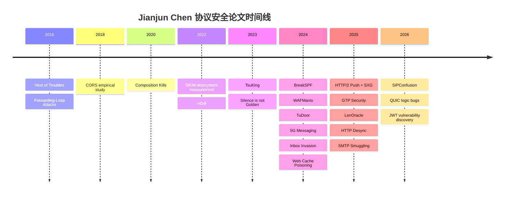

# 陈建军协议安全论文研究报告

## 执行摘要

**Takeaway**：如果把“协议安全”理解为“安全问题直接来自协议语义、实现差异、部署误配，或多组件之间对同一协议消息的不同解释”，那么在 Jianjun Chen 主页的公开论文列表中，可以筛出 **22 篇核心论文**。这些论文的长期主线非常清晰：一是持续追踪 **语义歧义 / parser discrepancy / differential interpretation** 这一根因，从早期的 HTTP Host 解析歧义、CORS 与邮件认证组合失配，发展到后来的 MIME、SIP、QUIC、JWT、WAF、DNS 响应预处理等；二是把方法从早期的人工案例分析，推进到 **NLP 抽规则、语法驱动生成、差分测试、灰盒覆盖、快照恢复和大规模实测** 的系统化工具链；三是越来越强调 **真实世界影响**，即不仅证明漏洞存在，还衡量其在公共邮件服务、运营商网络、开放解析器、浏览器与 Web 基础设施中的暴露面，并推动补丁、CVE、RFC/最佳实践更新。整体看，这是一条从 **Web/HTTP → 邮件认证 → DNS/蜂窝/实时通信 → 现代传输与令牌协议** 逐步扩展的协议安全研究路线。相关论文主要发表于 entity["organization","USENIX","security conference organizer"]、entity["organization","ACM","computing society"]、entity["organization","IEEE","engineering society"] 和 entity["organization","Internet Society","ndss organizer"] 旗下顶级安全会议。 citeturn15view0turn14view4turn16view0turn16view5turn15view3turn16view6turn16view4turn12view0turn12view1turn1view0

本报告的工作方式是：以作者主页 publication 列表为起点，逐条打开 paper 链接，随后用官方 venue 页面或 DOI 逐篇复核标题、年份与发表场所；摘要部分则尽量回到论文原文首页摘要、引言与方法概述，而不是依赖二手综述。需要说明的是，“protocol security” 不是作者主页上的现成标签，因此 **“22 篇核心论文”是基于公开列表做出的研究者分类判断**，不是站点自身提供的目录分类。 citeturn1view0turn21search0turn21search1turn21search2turn21search3turn7search0turn7search1turn7search2turn7search3turn8search0turn17search0turn17search20turn18search0turn19search2turn20search2turn20search3turn20search4turn20search9

## 范围与筛选口径

本报告采用的“协议安全”口径是：**论文的核心安全问题必须直接锚定到某个通信/消息协议、其实现逻辑、其规范语义，或跨组件对协议消息的解释差异**；如果论文主要是 CDN、云平台、Web 应用或物联网系统本身的安全问题，而协议仅是承载媒介，则暂不作为“核心协议安全论文”纳入。按这一定义，作者主页公开列表中共识别出 **22 篇核心论文**，时间跨度从 2016 到 2026。 citeturn1view0

在这个口径下，**HTTP Host、CORS、SMTP/SPF/DKIM/DMARC、MIME、DNS、SIP、QUIC、JWT、GTP、RCS/IMS、HTTP/2/SXG、HTTP Desync、无线环境中的 TCP/IP/UDP** 都被纳入，因为论文的攻击面直接来自协议格式、状态机、字段语义、解析差异或部署规则。相反，像 CDN origin validation、CDN back-to-origin 策略、CDN DoS 保护这类更偏系统设计的问题，虽然和请求转发语义有关，但更适合作为“协议相邻的系统安全工作”处理。JWT 这一项也存在边界性，因为它是令牌标准而非经典网络协议；本报告仍将其纳入，是因为论文讨论的正是 RFC 化令牌格式在认证/授权链中的安全语义与实现漏洞。 citeturn15view0turn14view5turn16view8turn14view3turn16view3turn15view3turn16view4turn12view0turn12view1turn10view5turn15view4turn10view4turn16view0turn10view3turn1view0

## 论文总表

下表列出按上述口径筛出的 **22 篇核心论文**。标题、年份与 venue 来自作者主页公开 publication 列表，并逐篇用官方 venue 页面或 DOI 交叉核对；“Link” 列同时给出作者站点 PDF 与官方 venue 页面，便于优先回到原始来源。 citeturn1view0turn17search20turn24search2turn8search0turn7search3turn7search2turn19search0turn17search0turn23search0turn21search3turn20search4turn20search9turn18search0turn8search1turn8search2turn21search2turn19search2turn20search2turn7search0turn7search1turn21search0turn20search3turn21search1

| Title | Year | Venue | Link | One-line contribution |
|---|---:|---|---|---|
| Host of Troubles: Multiple Host Ambiguities in HTTP Implementations | 2016 | ACM CCS 2016 | [PDF](https://www.jianjunchen.com/p/host-of-troubles.CCS16.pdf) / [Venue](https://doi.org/10.1145/2976749.2978394) | 系统揭示 HTTP Host 字段歧义可造成缓存投毒与策略绕过。 |
| Forwarding-Loop Attacks in Content Delivery Networks | 2016 | NDSS 2016 | [PDF](https://www.jianjunchen.com/p/cdn-loops.NDSS16.pdf) / [Venue](https://doi.org/10.14722/ndss.2016.23442) | 揭示 CDN 转发环能够被低成本放大为资源消耗与 DoS。 |
| We Still Don’t Have Secure Cross-Domain Requests: an Empirical Study of CORS | 2018 | USENIX Security 2018 | [PDF](https://www.jianjunchen.com/p/CORS-USESEC18.pdf) / [Venue](https://www.usenix.org/conference/usenixsecurity18/presentation/chen-jianjun) | 系统揭示 CORS 在设计、实现和部署层面的三类安全问题。 |
| Composition Kills: A Case Study of Email Sender Authentication | 2020 | USENIX Security 2020 | [PDF](https://www.jianjunchen.com/p/composition-kills.USESEC20.pdf) / [Venue](https://www.usenix.org/conference/usenixsecurity20/presentation/chen-jianjun) | 证明邮件认证链的组件组合会系统性破坏“已认证发件人”的安全假设。 |
| A Large-scale and Longitudinal Measurement Study of DKIM Deployment | 2022 | USENIX Security 2022 | [PDF](https://www.jianjunchen.com/p/dkim.USESEC22.pdf) / [Venue](https://www.usenix.org/conference/usenixsecurity22/presentation/wang-chuhan) | 首次长期、大规模测量 DKIM 部署、误配和密钥管理问题。 |
| HDiff: A Semi-automatic Framework for Discovering Semantic Gap Attack in HTTP Implementations | 2022 | IEEE/IFIP DSN 2022 | [PDF](https://www.jianjunchen.com/p/hdiff.dsn22.pdf) / [Venue](https://doi.org/10.1109/DSN53405.2022.00014) | 用“规范抽取 + 差分测试”半自动发现 HTTP 语义差攻击。 |
| TsuKing: Coordinating DNS Resolvers and Queries into Potent DoS Amplifiers | 2023 | ACM CCS 2023 | [PDF](https://www.jianjunchen.com/p/tsuking.CCS23.pdf) / [Venue](https://doi.org/10.1145/3576915.3616668) | 证明多个 DNS 解析器可被协同成指数级放大器。 |
| Silence is not Golden: Disrupting the Load Balancing of Authoritative DNS Servers | 2023 | ACM CCS 2023 | [PDF](https://www.jianjunchen.com/p/silence-is-not-golden.CCS23.pdf) / [Venue](https://doi.org/10.1145/3576915.3616647) | 破坏权威 DNS 负载均衡，降低劫持与缓存投毒门槛。 |
| BreakSPF: How Shared Infrastructures Magnify SPF Vulnerabilities Across the Internet | 2024 | NDSS 2024 | [PDF](https://www.jianjunchen.com/p/break-spf.NDSS24.pdf) / [Venue](https://doi.org/10.14722/ndss.2024.23113) | 证明共享云/CDN/IP 池显著放大 SPF 漏洞。 |
| Break the Wall from Bottom: Automated Discovery of Protocol-Level Evasion Vulnerabilities in Web Application Firewalls | 2024 | IEEE S&P 2024 | [PDF](https://www.jianjunchen.com/p/wafmanis.sp24.pdf) / [Venue](https://doi.org/10.1109/SP54263.2024.00129) | 自动发现 WAF 与 Web 应用 HTTP 解析差异导致的通用绕过。 |
| TuDoor Attack: Systematically Exploring and Exploiting Logic Vulnerabilities in DNS Response Pre-processing with Malformed Packets | 2024 | IEEE S&P 2024 | [PDF](https://www.jianjunchen.com/p/tudoor.sp24.pdf) / [Venue](https://doi.org/10.1109/SP54263.2024.00172) | 系统挖掘 DNS 响应预处理逻辑漏洞并形成三类攻击。 |
| Uncovering Security Vulnerabilities in Real-world Implementation and Deployment of 5G Messaging Services | 2024 | ACM WiSec 2024 | [PDF](https://www.jianjunchen.com/p/sipano-wisec24.pdf) / [Venue](https://doi.org/10.1145/3643833.3656131) | 首次系统评估真实 5G 消息业务的运营商部署与终端实现缺陷。 |
| Inbox Invasion: Exploiting MIME Ambiguities to Evade Email Attachment Detectors | 2024 | ACM CCS 2024 | [PDF](https://www.jianjunchen.com/p/inbox-invasion.CCS24.pdf) / [Venue](https://doi.org/10.1145/3658644.3670386) | 利用 MIME 语义歧义绕过附件检测器与客户端安全检查。 |
| Internet’s Invisible Enemy: Detecting and Measuring Web Cache Poisoning in the Wild | 2024 | ACM CCS 2024 | [PDF](https://www.jianjunchen.com/p/web-cache-posioning.CCS24.pdf) / [Venue](https://doi.org/10.1145/3658644.3690361) | 提出 HCache 并在野外系统测量 Web Cache Poisoning。 |
| Cross-Origin Web Attacks via HTTP/2 Server Push and Signed HTTP Exchange | 2025 | NDSS 2025 | [PDF](https://www.jianjunchen.com/p/http2-push-sxg.NDSS25.pdf) / [Venue](https://doi.org/10.14722/ndss.2025.231086) | 利用 HTTP/2 Push 与 SXG 下的 authority/SAN 语义松弛绕过 SOP。 |
| Invade the Walled Garden: Evaluating GTP Security in Cellular Networks | 2025 | IEEE S&P 2025 | [PDF](https://www.jianjunchen.com/p/gtp-cellular.sp25.pdf) / [Venue](https://doi.org/10.1109/SP61157.2025.00028) | 首次系统评估 GTP 暴露面与 3G–5G 核心网攻击面。 |
| The Danger of Packet Length Leakage: Off-path TCP/IP Hijacking Attacks Against Wireless and Mobile Networks | 2025 | IEEE EuroS&P 2025 | [PDF](https://www.jianjunchen.com/p/tcp-wireless-hijack.eurosp25.pdf) / [Venue](https://doi.org/10.1109/EuroSP63326.2025.00051) | 利用无线密文长度侧信道实现 off-path TCP/UDP 劫持。 |
| The Silent Danger in HTTP: Identifying HTTP Desync Vulnerabilities with Gray-box Testing | 2025 | USENIX Security 2025 | [PDF](https://www.jianjunchen.com/p/http-desync.USESEC25.pdf) / [Venue](https://www.usenix.org/conference/usenixsecurity25/presentation/mu) | 用灰盒覆盖引导差分测试发现请求、响应与 CGI 三侧 Desync。 |
| Email Spoofing with SMTP Smuggling: How the Shared Email Infrastructures Magnify this Vulnerability | 2025 | USENIX Security 2025 | [PDF](https://www.jianjunchen.com/p/smtp-smuggling.USESEC25.pdf) / [Venue](https://www.usenix.org/conference/usenixsecurity25/presentation/wang-chuhan) | 证明 SMTP Smuggling 会被共享邮件基础设施显著放大。 |
| SIPConfusion: Exploiting SIP Semantic Ambiguities for Caller ID and SMS Spoofing | 2026 | NDSS 2026 | [PDF](https://www.jianjunchen.com/p/sip-confusion.NDSS26.pdf) / [Venue](https://doi.org/10.14722/ndss.2026.230116) | 用 SIPCHIMERA 挖掘 SIP 语义歧义导致的 Caller ID/SMS 欺骗。 |
| Identifying Logical Vulnerabilities in QUIC Implementations | 2026 | NDSS 2026 | [PDF](https://www.jianjunchen.com/p/quic-logic.NDSS26.pdf) / [Venue](https://doi.org/10.14722/ndss.2026.231777) | 用 MerCuriuzz 自动发现 QUIC 实现中的逻辑漏洞。 |
| Token Time Bomb: Evaluating JWT Implementations for Vulnerability Discovery | 2026 | NDSS 2026 | [PDF](https://www.jianjunchen.com/p/jwt.NDSS26.pdf) / [Venue](https://doi.org/10.14722/ndss.2026.240697) | 用 JWTeemo 系统发现 JWT 实现中的绕过与 DoS 问题。 |

注：**Forwarding-Loop Attacks in Content Delivery Networks** 被本报告作为“边界纳入项”处理——它更偏 CDN 转发控制与系统安全，但攻击根因直接来自跨 CDN 的消息转发表达和循环语义，因此仍保留在核心表中。 citeturn15view1turn24search2turn1view0

## 主题关系与时间演进

从时间上看，这条研究路线并不是简单地“换协议做同样的事”，而是在不断抽象同一类根因：**规范允许的弹性、实现的宽松解析、系统组件的异步演化、以及共享基础设施导致的安全边界扩张**。2016–2020 年主要聚焦 Web/HTTP 与邮件认证的“解释差”；2022 年开始把这种问题形式化为半自动或自动化框架；2023–2026 年则显著扩展到 DNS、蜂窝核心网、SIP、QUIC、JWT，并且更加偏重 Internet-scale measurement 与真实生态影响。 citeturn15view0turn14view5turn16view8turn14view4turn15view3turn15view2turn16view6turn16view4turn12view0turn12view1

如果进一步按技术方法而不是按协议对象来分类，这 22 篇论文大致形成三条脉络。第一条是 **语义歧义与差分解释**：Host of Troubles、HDiff、WAFManis、HTTP Desync、Inbox Invasion、SIPConfusion、JWT、QUIC 都在问“同一份消息，多个组件是否会理解成不同东西”。第二条是 **共享基础设施放大风险**：Composition Kills、DKIM、BreakSPF、SMTP Smuggling 都说明认证机制本身不一定坏，但一旦接入共享 IP、共享 SPF、共享软件栈或弱一致客户端显示逻辑，风险会被成倍放大。第三条是 **互联网与蜂窝基础设施的暴露面测量**：TsuKing、Disablance、TuDoor、5G Messaging、GTP、LenOracle 关注的是“原本被假定为安全边界内”的基础设施，实际上如何被外部或 off-path 攻击者触达。 citeturn14view4turn16view0turn16view3turn16view4turn12view1turn12view0turn16view8turn14view3turn12view3turn16view5turn15view3turn15view2turn16view2turn15view4turn16view6turn10view3

## 分论文解读

**Web、HTTP、浏览器与 CDN 方向。**

**Host of Troubles: Multiple Host Ambiguities in HTTP Implementations**。背景上，Host 头是 HTTP 路由、缓存策略和多租户隔离的安全关键字段。动机在于作者发现，即便规范对 host-related 字段相对明确，真实实现仍会对多 Host 头、absolute-URI 与 Host 混用、空白字符等边界情况作出不一致解析。论文要解决的问题是：这些不一致在请求链路上如何演化成可利用的前后端语义差，并最终触发缓存投毒和安全策略绕过。方法上，作者系统构造带歧义 host 字段的请求，对串联 HTTP 实现进行比较式测试，从而定义并验证一整类基于 Host 解释差的攻击。 citeturn15view0turn17search20turn1view0

**Forwarding-Loop Attacks in Content Delivery Networks**。这篇论文的背景是 CDN 普遍支持回源、重试、跨 CDN 转发和多层缓存，从而把“转发控制”本身变成攻击面。其动机是说明：即使没有传统的流量放大器，恶意客户也可能通过构造转发环让同一请求在 CDN 内部或多个 CDN 之间被重复处理。论文聚焦的问题是 forwarding loop 如何变成资源消耗和 DoS，现有 loop detection 为什么能被绕过，以及多 CDN 环境下为何难以统一修复。方法上，作者对 16 家商业 CDN 做受控实验，并进一步提出更隐蔽的 Dam Flooding 攻击，分析自动探测、重试、解压等内部机制如何继续放大负载；这也是它被本报告作为“边界纳入”的原因——更偏系统安全，但根因确实在消息转发语义。 citeturn15view1turn12view4turn24search2turn1view0

**We Still Don’t Have Secure Cross-Domain Requests: an Empirical Study of CORS**。背景是浏览器同源策略默认把跨域网络资源限制为“可写不可读”，而现实 Web 应用又迫切需要安全地读取跨域资源。研究动机在于：CORS 虽然是浏览器支持的标准化替代方案，但其设计、实现、部署是否真的比 JSON-P 等旧做法更安全，并不清楚。论文具体指出三类问题：CORS 以一些微妙方式放宽了跨域“写”权限；它引入了新的高风险信任依赖；其策略表达能力和与其他 Web 机制的交互复杂度导致大面积误配。方法上，作者做了面向真实网站生态的经验研究，并据此提出协议简化与规范澄清建议，其中部分后来被规范和主流浏览器采纳。 citeturn14view5turn13view6turn8search0turn1view0

**HDiff: A Semi-automatic Framework for Discovering Semantic Gap Attack in HTTP Implementations**。背景是现代 HTTP 请求通常会经过缓存、代理、WAF、CDN 等多个中间盒，语义差攻击已经不仅是个别 bug，而是一类系统结构性问题。动机在于以往研究能发现单个案例，但基本依赖手工分析，缺乏可扩展方法。论文要解决的核心问题是：如何从 RFC 文本里抽取“应然规则”，并自动比较不同实现是否在这些规则上出现偏差。方法上，HDiff 用 NLP 设计文档分析器，从规范中抽取规则，再通过差分测试在 10 个主流 HTTP 实现间寻找偏差，最终发现三类语义差攻击、14 个漏洞和 29 组受影响 server pair，并拿到多个 CVE。 citeturn14view4turn19search0turn1view0

**Break the Wall from Bottom: Automated Discovery of Protocol-Level Evasion Vulnerabilities in Web Application Firewalls**。背景是 WAF 的工作前提是“先正确理解 HTTP，再基于规则拦截 payload”；一旦解析过程和后端应用不同步，攻击者就能把恶意内容“藏进协议结构”而不是 payload 本身。动机在于这类漏洞此前多靠人工发现，且现有绕过测试更关注变形 payload，而非变形协议。论文具体要解决两个问题：如何生成既保留攻击语义又改变 HTTP 结构的测试样本，以及如何在闭源、远程的 WAF 场景中自动识别 parser discrepancy。方法上，WAFManis 采用语法树驱动、payload-aware 的请求生成与变异，并把 WAF 与 20 个后端框架的解析结果做差分比较，最终在 14 个 WAF 和 20 个框架中发现大规模通用绕过案例。 citeturn10view8turn16view1turn0search1turn20search4turn1view0

**Internet’s Invisible Enemy: Detecting and Measuring Web Cache Poisoning in the Wild**。背景是 Web Cache Poisoning 早已被知道很危险，但长期缺乏系统化、可规模化的互联网测量。动机在于以往研究多是 case-by-case，难以回答“野外实际有多严重”的问题。论文聚焦的问题是：如何自动识别 cache key 与响应处理之间的错位，尤其是由未充分纳入 cache key 的 header 触发的 poisoning 面。方法上，作者提出 HCache 测试方法，对 Tranco Top 1000 及其子域进行系统检测，并归纳出多种此前未被充分讨论的 caching headers/向量，从而把 WCP 从零散 exploit 提升为可测量的互联网级安全问题。 citeturn0search16turn8search2turn1view0

**The Silent Danger in HTTP: Identifying HTTP Desync Vulnerabilities with Gray-box Testing**。背景是 HTTP Desync 来自链路上多个 HTTP 实现对请求边界和消息队列的不同理解，影响已经远不止传统 request smuggling。动机在于现有工具要么是字典式扫描器，要么是黑盒模糊器，既看不到内部状态，也基本只测试 request-side desync。论文要解决的问题是：如何在不依赖源码白盒的前提下，用覆盖信息引导差分测试，同时扩展到 response 与 CGI response 的不同步。方法上，HDHunter 采用灰盒 coverage-directed differential testing，用执行覆盖与解析结果差异共同驱动变异和判定，最终在 19 个 HTTP 实现里发现了新的 desync 漏洞。 citeturn10view2turn16view0turn7search0turn1view0

**Cross-Origin Web Attacks via HTTP/2 Server Push and Signed HTTP Exchange**。背景是浏览器同源策略把 origin 绑定到 URI，而新 HTTP 特性如 server push 和 SXG 又引入了 authority、证书 SAN 等新语义。动机在于这些新特性是否会在“协议 authority”与“浏览器 origin”之间制造新的安全缝隙。论文聚焦的问题是：严格的 URI-origin 为何会被更宽松的 SAN/authority 语义削弱，以及共享证书如何使攻击者跨多个无关域实施 off-path 攻击。方法上，作者提出 CrossPUSH 与 CrossSXG 两条攻击路径，并结合域名转卖/接管、validation reuse、AGP、证书撤销阻滞等技术说明攻击条件可现实获得，再配合客户端与服务端测量来评估受影响浏览器、App 与网站范围。 citeturn10view4turn12view2turn21search2turn1view0

**邮件认证与内容解析方向。**

**Composition Kills: A Case Study of Email Sender Authentication**。背景是 SMTP 原生并不提供强身份认证，因此现代邮件系统叠加了 SPF、DKIM、DMARC 等多种认证与展示机制。动机在于这些机制由不同组件——发送端、接收端、过滤规则、客户端 UI——共同构成，安全性未必是“机制安全性”的简单相加。论文要解决的问题是：组件间对同一封邮件的解释不一致，会如何破坏“认证通过 = 发件人可信”的用户认知。方法上，作者结合手工分析与黑盒测试，在多个邮件服务商与客户端上挖掘出 18 类规避/欺骗技术，并把攻击归类为 intra-server、UI-mismatch 与 ambiguous-replay 等类型，证明即便是谨慎用户也可能被“看似认证正确”的伪造邮件欺骗。 citeturn13view5turn16view8turn7search3turn1view0

**A Large-scale and Longitudinal Measurement Study of DKIM Deployment**。背景是 DKIM 在邮件认证链里负责保护邮件头/正文完整性，但其真实部署状态长期缺乏可观测性，因为 selector 随机、记录分散、签名样本不易规模收集。动机在于没有足够数据，就无法判断 DKIM 到底是“被广泛正确部署”，还是“表面站得住、细节到处漏”。论文具体要处理的问题是 DKIM 采用率、误配比例、密钥管理与签名质量。方法上，作者综合了五年被动 DNS 中的 950 万条 DKIM 记录、4.6 亿封真实邮件头中的 DKIM 签名，以及 Top 1M 域名主动测量，得出了部署率、误配率与广泛的密钥管理问题，从而把 DKIM 的风险从个案提升为生态级治理问题。 citeturn14view3turn16view7turn7search2turn1view0

**BreakSPF: How Shared Infrastructures Magnify SPF Vulnerabilities Across the Internet**。背景是 SPF 以发送 IP 绑定身份，是邮件认证链的基础步骤。研究动机在于，过去对 SPF 的讨论多停留在“记录写得太宽泛”这一理论层面，而没有充分考虑现代云服务、代理、CDN、serverless 和共享 SPF 记录如何把可攻击性放大。论文聚焦的问题不是“是否存在语法上宽松的 SPF”，而是“攻击者能否实际拿到被记录允许的 IP”，尤其是在共享基础设施场景下。方法上，作者提出 BreakSPF，结合 permissive SPF、可获得 IP 池与共享基础设施做大规模实验，并在 Tranco Top 1M 上评估真实暴露面，展示 SPF 风险已经从配置问题演化为基础设施集中化问题。 citeturn11view2turn12view3turn21search3turn1view0

**Inbox Invasion: Exploiting MIME Ambiguities to Evade Email Attachment Detectors**。背景是恶意邮件附件长期是主要入侵向量，附件检测器和客户端都高度依赖 MIME 对邮件内容的结构化表达。动机在于以往对附件绕过的大量研究强调内容混淆、壳与变形，却低估了解析器之间对 MIME 的边界条件理解不同所带来的绕过能力。论文要解决的问题是：安全检测器与客户端如何因 MIME 解析不一致而见到“不同的附件”，以及如何系统化地枚举这种差异。方法上，作者提出 MIMEminer，对 16 个内容检测器和 7 个邮件客户端进行系统测试，进而归纳出多类新绕过方法，证明攻击者可以通过操纵 MIME 结构而不是恶意二进制本身来躲过检测。 citeturn16view3turn8search1turn1view0

**Email Spoofing with SMTP Smuggling: How the Shared Email Infrastructures Magnify this Vulnerability**。背景是 SMTP Smuggling 在 2023 年被公开，但它的产业级影响和修复进展并不清楚。动机有两个：一是作者怀疑其危害被低估，因为共享邮件基础设施会把单点漏洞放大；二是私有邮件系统很难在伦理上做大规模测量。论文聚焦的问题是：发送侧与接收侧对 DATA 结束标记的差异如何导致绕过 SPF/DMARC 的伪造，以及如何在不对私有系统造成不当影响的前提下测量暴露面。方法上，作者做了对公共邮件服务、开源邮件软件和安全网关的实证评估，又设计了用户研究、DKIM side channel 与 non-intrusive testing 来覆盖私有邮件系统，最终把 SMTP Smuggling 从单个 exploit 扩展为共享基础设施层面的系统性风险。 citeturn4view0turn16view5turn7search1turn1view0

**DNS、蜂窝、实时通信与新型协议方向。**

**TsuKing: Coordinating DNS Resolvers and Queries into Potent DoS Amplifiers**。背景是传统 DNS 放大攻击主要把单个开放解析器当作独立放大器。动机在于现实 DNS 解析器实现存在大量不一致与复杂交互，这是否允许攻击者把多个解析器串联成“协调放大器”尚未被系统回答。论文要解决的问题是：攻击者能否用精心构造的查询和多个解析器之间的交互，让放大因子随层数增长而指数上升。方法上，作者提出 DNSRetry、DNSChain、DNSLoop 三种变体，利用实现不一致制造协同放大，并在 130 万开放解析器上做测量，在真实受控环境中验证高放大倍数。 citeturn15view3turn17search0turn1view0

**Silence is not Golden: Disrupting the Load Balancing of Authoritative DNS Servers**。背景是域名通常部署多个权威 NS 来做容灾和负载均衡，而解析器也会基于全局状态选择 nameserver。动机在于“负载均衡”看似是可用性机制，但一旦被操控，就可能把大量合法请求引流到攻击者想压垮的某个权威服务器。论文聚焦的问题是：哪些 nameserver / resolver 行为会让攻击者通过少量配置和请求操纵，悄悄破坏权威 NS 的选择逻辑。方法上，作者提出 Disablance，利用 authoritative server 对越权域的处理方式与 recursive resolver 的共享状态选择机制联动，进而在大规模测量中证明受害域、开放解析器和公共 DNS 服务的实际暴露面。 citeturn15view2turn23search0turn23search9turn1view0

**TuDoor Attack: Systematically Exploring and Exploiting Logic Vulnerabilities in DNS Response Pre-processing with Malformed Packets**。背景是 DNS 的规则表面上很简单，但 resolver 端对响应的预处理链极其复杂，而此前研究通常只盯着 cache poisoning 或 bailiwick checking 的局部。动机在于需要一个“端到端理解预处理流程”的系统视角。论文具体要解决的问题是：畸形 DNS 响应在进入 resolver 后，会经过哪些状态与检查，哪些地方存在逻辑漏洞可被利用为缓存投毒、DoS 或资源消耗。方法上，作者系统审阅 DNS RFC，逆向分析 28 个主流 DNS 软件实现，总结出状态机式预处理流程，再构造 malformed response packets 去打穿这些状态，从而提炼出三类新的逻辑漏洞。 citeturn10view9turn16view2turn20search9turn1view0

**Uncovering Security Vulnerabilities in Real-world Implementation and Deployment of 5G Messaging Services**。背景是 RCS/IMS 驱动的 5G 消息服务已经在上百运营商和海量终端上部署，但公开安全研究相对稀缺。动机在于 5G 消息并不是单一软件，而是运营商端部署、IMS/RCS 协议和手机端实现共同构成的系统。论文要回答的问题是：运营商侧配置和终端侧实现分别存在哪些漏洞，这些漏洞能否导致实际攻防后果。方法上，作者开发半自动测试工具，对三家大型运营商和 6 台支持 5G 消息的设备进行分析，归纳出 MITM、零点击信息泄露、存储/流量耗尽和 DoS 等四类漏洞。 citeturn15view4turn18search0turn1view0

**Invade the Walled Garden: Evaluating GTP Security in Cellular Networks**。背景是蜂窝核心网和回传网长期被当作“围墙花园”，安全依赖物理隔离，因此学界更多关注无线接入侧。动机在于 IP 化、服务化之后，这个假设可能不再成立，尤其是 GTP 仍是 3G 到 5G 的用户面关键协议。论文聚焦的问题是：现实世界里有多少 GTP 主机对公网可见，哪些消息类型可被滥用，以及外部攻击者能否借此影响核心网和用户流量。方法上，作者借助半自动工具进行 Internet-scale 扫描，统计可访问 GTP 主机与运营商覆盖，同时在开源 4G/5G 实验环境中验证会话劫持、远程 DoS 和 RDoS 等攻击。 citeturn10view5turn16view6turn19search2turn1view0

**The Danger of Packet Length Leakage: Off-path TCP/IP Hijacking Attacks Against Wireless and Mobile Networks**。背景是 5G/4G/3G 与 Wi‑Fi 广泛依赖加密与完整性保护，通常被认为足以阻止窃听与注入。动机在于作者注意到：即便无法看到明文，基于流密码的无线链路仍会暴露 IP 包长度，而这个“看似无害”的长度侧信道可能足以推断会话状态。论文要解决的问题是：off-path 攻击者能否借长度侧信道、NAT 位置和 TCP 机制推断四元组、序列号、ACK 号，进而劫持 TCP/UDP 连接。方法上，LenOracle 采用分阶段的 guess-and-check 策略，在商业 LTE 和真实 Wi‑Fi 网络中验证了短消息注入、伪造 DNS 响应和缓存污染等实际后果。 citeturn10view3turn19search1turn20search2turn1view0

**SIPConfusion: Exploiting SIP Semantic Ambiguities for Caller ID and SMS Spoofing**。背景是 SIP 是 VoIP、VoLTE、RCS 的信令基石，并且已经配套有 digest auth、identity assertion 以及 STIR/SHAKEN 等反欺骗机制。动机在于作者发现，真正的风险未必来自“没有认证”，而可能来自代理与用户代理对身份相关 header 的语义理解不同。论文聚焦的问题是：攻击者在有/无凭据两种条件下，如何通过操纵 identity headers 让不同 SIP 实体产生解释分歧，从而绕过认证并实施 Caller ID 或 RCS SMS 欺骗。方法上，作者提出黑盒模糊框架 SIPCHIMERA，对多个 SIP server 和 user agent 组合做大规模测试，并进一步在 VoIP 设备、商业 SIP 服务和运营商级 RCS 平台上验证真实影响。 citeturn2view0turn16view4turn21search0turn1view0

**Identifying Logical Vulnerabilities in QUIC Implementations**。背景是 QUIC 已成为主流平台的大规模传输层协议，但现有测试工具大多擅长发现内存破坏类 bug，而不擅长协议逻辑缺陷。动机在于 QUIC 的状态机复杂、帧序列长、服务重置代价高，传统随机变异很难穿透到真正的逻辑脆弱点。论文要解决的问题是：如何高效生成复杂帧序列、如何在不依赖 crash 的前提下检测逻辑异常、以及如何快速回滚服务状态以支持 fuzzing。方法上，MerCuriuzz 采用分段式 mutation、基于 differential testing 的语义/公共资源一致性检测器，以及基于 Nyx 的 snapshot manager，使逻辑漏洞发现从手工审计转向自动化测试。 citeturn10view0turn12view0turn20search3turn1view0

**Token Time Bomb: Evaluating JWT Implementations for Vulnerability Discovery**。背景是 JWT 已广泛充当现代 Web 与分布式系统中的认证/授权令牌。动机在于虽然过去已经报道过一些签名绕过或算法混淆类漏洞，但缺乏对 JWT 实现的系统性、跨语言评估。论文聚焦三类问题：如何生成能系统触发漏洞的 JWT、如何自动检测解析分歧与资源耗尽、以及漏洞在现实实现中的普遍性如何。方法上，JWTeemo 用 Function-extended BNF 去建模 JWT 语法，结合反馈驱动生成与 differential analyzer，对 10 种语言上的 43 个实现做测试，并进一步归纳出签名/加密混淆、算法混淆、格式混淆、Billion Hashes 和压缩 DoS 等主类。 citeturn10view1turn12view1turn21search1turn1view0

## 边界项与未指明之处

首先，**“协议安全”不是作者主页的显式分类**，而是本报告依据论文题目、摘要、方法对象与攻击面做出的工作性归类，因此存在天然边界。最明显的边界项包括：**Forwarding-Loop Attacks in Content Delivery Networks**（本报告纳入，但可视为 CDN 系统安全）、**ReqsMiner**、**CDN Judo**、**CDN Cannon**、**Abusing CDNs for Fun and Profit**（都与请求转发/回源/校验策略有关，但更偏 CDN 系统设计），以及 **SPEC2CODE**（协议规约到代码映射工具，安全相关但不是直接安全评估）、**My ZIP isn’t your ZIP**（语义差问题明显，但对象是压缩文件格式而非通信协议）。如果读者采用更严格的“只统计标准化通信协议”口径，上述几篇应从主表中移出。 citeturn1view0

其次，个别论文在公开索引里存在 **venue/版本歧义**。最典型的是 **Silence is not Golden**：作者主页把它列作 **CCS'23**，而公开索引中也能搜到同题目的其他 DOI 版本；本报告因此遵循作者主页列示的 CCS'23 版本，并采用与之对应的 DOI `10.1145/3576915.3616647`。这类情况不影响论文技术内容本身，但在制作精确书目时应优先跟随作者主页或最终出版页，而不是只看聚合索引。 citeturn1view0turn23search0turn23search9turn23search6

再次，有些论文的**外推边界需要谨慎理解**。例如 **5G Messaging** 的运营商/设备实测覆盖三家大型运营商和六台设备，说明存在真实风险，但不等于所有运营商和终端都同样受影响；**GTP Security** 明确证明公网暴露面巨大，并在开源 4G/5G 实验环境中验证了利用，但对全部现实核心网的 end-to-end 可达性仍取决于各运营商路由与过滤策略；**SMTP Smuggling** 对私有邮件系统的测量采用了用户研究、DKIM side channel 与 non-intrusive testing，伦理上更稳健，但也意味着部分判断基于信号侧推而非对每个私有域的完整交互复现；**2026 年的 SIP、QUIC、JWT 三篇论文**都还相对新，截止 2026-05 的下游补丁普及、长期生态修复与二次标准化影响仍在演化。 citeturn15view4turn16view6turn16view5turn16view4turn12view0turn12view1

## 结论

把这 22 篇论文放在一起看，Jianjun Chen 在协议安全上的核心贡献，不是仅仅发现若干高危漏洞，而是反复证明了一个更深的命题：**安全协议或安全机制本身“存在”并不等同于安全成立，真正决定安全边界的是多实现、多组件、多层中间盒和共享基础设施对同一协议消息的共同解释是否一致**。从 HTTP Host、CORS、邮件认证组合，到 MIME、WAF、HTTP Desync、SIP、QUIC、JWT，这条主线一直没有变。 citeturn15view0turn14view5turn16view8turn16view3turn16view0turn16view4turn12view0turn12view1

第二个清晰结论是，研究正在从“解释漏洞是什么”走向“如何工业化发现这类漏洞”。早期工作更多证明问题存在；中期的 HDiff 已经把 RFC 抽取与差分测试结合起来；后期的 WAFManis、HDHunter、SIPCHIMERA、MerCuriuzz、JWTeemo 则把这套思路迁移到 WAF、HTTP、SIP、QUIC、JWT 等不同对象上，形成一条相当统一的方法论：**规范/语法建模 → 测试样本生成 → 差分或灰盒反馈 → 真实部署验证**。这也是这些论文对协议安全研究社区最有启发性的部分。 citeturn14view4turn10view8turn16view0turn16view4turn12view0turn12view1

第三个结论是，研究主题虽从 Web 渐次扩展到邮件、DNS、蜂窝核心网和实时通信，但总体趋势并不是发散，而是在更加统一地回答同一个问题：**哪些被运营者和开发者视为“默认安全”的协议边界，其实只是尚未被系统测量和自动化挖掘过的脆弱边界**。因此，这组论文最重要的研究趋势并非“协议种类增多”，而是 **从局部 exploit 走向生态级、可复验、可工具化的协议安全科学**。 citeturn15view3turn15view2turn15view4turn16view6turn10view3turn16view5turn1view0